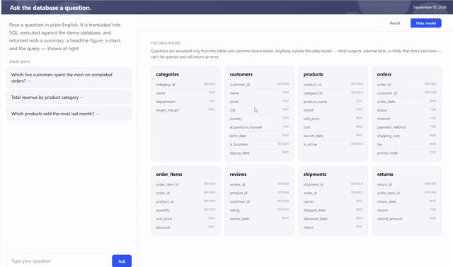
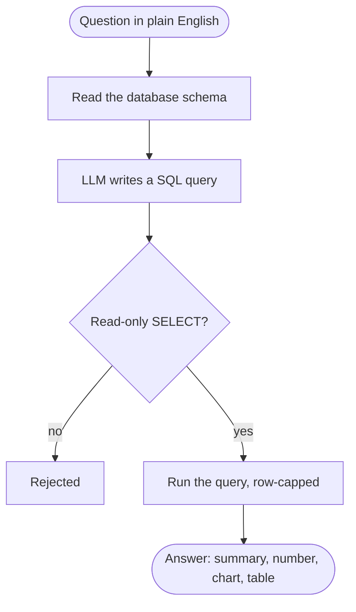

# Natural Language to SQL Chatbot

AI-powered analytics assistant that lets business users query relational
data in plain English. It dynamically inspects the database schema,
generates and validates read-only SQL, executes the query, and returns an
interpretable answer with key metrics, visualizations, source data, and the
generated SQL.

<p align="center">
  
</p>

It exists to cut the volume of routine data requests to the analytics team
and give stakeholders faster self-serve reporting. It only runs read-only
`SELECT` queries and caps rows returned. Available as a web app and a JSON
API, it currently runs on a demo database.

## How it works

A question travels through five steps before an answer comes back:



1. **Read the schema** — list the tables, columns, and relationships so the
   model knows what it can query.
2. **Write the SQL** — the LLM turns the question plus schema into a single
   `SELECT`.
3. **Safety check** — reject anything that isn't a read-only `SELECT` (no
   `INSERT`/`UPDATE`/`DELETE`/`DROP`, no stacked statements).
4. **Run it** — execute against the database with a short timeout and a row
   cap.
5. **Answer** — return the rows, a written summary, the headline figure, and
   a chart; the generated SQL is always included.

The sections below break down the same flow at the code level.

### Component overview

| Layer | File | Responsibility |
|-------|------|----------------|
| HTTP API | `app/main.py` | FastAPI routes (`/`, `/ask`, `/schema`, `/health`), request/response models, error mapping, CORS |
| LLM | `app/llm.py` | `generate_sql()` and `summarize_results()`; model IDs from `SQL_MODEL` / `SUMMARY_MODEL`; prompt rules; response cleanup |
| Data | `app/db.py` | schema introspection, `validate_sql()` (regex allow/deny list), `run_query()` with timeout + row cap, against DuckDB |
| Data build | `dbt/`, `scripts/generate_seed_data.py` | dbt project that builds the demo dataset (`demo.duckdb`): seed CSVs -> typed staging models -> mart tables with real PK/FK constraints and a few computed columns (margin, lifetime revenue, delivery time) |
| Frontend | `app/static/index.html` | single-file UI: chat history, schema view, and rendering of summary / callout / chart / table |

### Request lifecycle (`POST /ask`)

1. **Introspect** — read every table, column, and foreign key from the DB and
   render a compact text schema for the prompt.
2. **Generate** — send schema + question to the LLM at `temperature=0`; the
   system prompt constrains it to a single schema-bound `SELECT` and requires
   case-insensitive text comparisons. The raw reply is stripped of markdown
   fences and any surrounding prose.
3. **Validate** — `validate_sql()` rejects anything that isn't a lone
   `SELECT` / `WITH`, contains a second statement, or matches the forbidden-
   keyword list (`INSERT`, `UPDATE`, `DELETE`, `DROP`, `ALTER`, `CREATE`,
   `ATTACH`, `PRAGMA`, …). Rejection → HTTP 400 with the offending SQL.
4. **Execute** — run against DuckDB on a read-only connection, cancelled if
   it runs past a 5-second timeout, and `fetchmany(200)` so a broad query
   can't return unbounded rows.
5. **Summarize** — if `include_summary` is true (default), a second LLM call
   turns the rows into 1–2 sentences. This step is best-effort: any failure
   leaves `summary` null rather than failing the request.
6. **Respond** — return `question`, `sql`, `rows`, `row_count`, and
   `summary`. The web UI derives the headline figure, the descending-sorted
   bar chart, and the results table from this payload on the client.

## Setup

### 1. Install dependencies

```bash
pip install -r requirements.txt
```

### 2. Add your OpenAI API key

```bash
cp .env.example .env
```

Then edit `.env` and set `OPENAI_API_KEY=sk-...` (get a key at
https://platform.openai.com/api-keys). The app loads `.env` automatically on
startup via `python-dotenv`; a plain `export OPENAI_API_KEY=...` works too.

Optional: set `SQL_MODEL` / `SUMMARY_MODEL` in `.env` to use a different model
(default `gpt-4o-mini`).

### 3. Build the demo database

```bash
pip install -r requirements-dbt.txt   # dbt-core + dbt-duckdb; build-time only
python scripts/generate_seed_data.py
dbt seed --project-dir dbt --profiles-dir dbt
dbt run  --project-dir dbt --profiles-dir dbt
```

This builds `demo.duckdb`: an eight-table online-store schema (`categories`,
`customers`, `products`, `orders`, `order_items`, `reviews`, `shipments`,
`returns`) with ~300 customers and ~3,500 orders, plus a few dbt-computed
columns (product margin, customer lifetime revenue, shipment delivery time).
Every date is anchored to today and order volume is seasonally weighted, so
time-based questions ("revenue last month", "return rate this quarter")
always hit real data. Re-run it any time to refresh; the data shape is
deterministic (fixed seed). `dbt test --project-dir dbt --profiles-dir dbt`
runs the schema's data-quality tests (uniqueness, not-null, FK relationships).

### 4. Run

```bash
uvicorn app.main:app --reload
```

- **Web UI:** http://localhost:8000/
- **Interactive API docs:** http://localhost:8000/docs

## Web UI

A two-pane workspace: the conversation on the left, the answer on the right.
Each answer shows the model's summary, a large headline figure, a sorted bar
chart, the full result table, and the generated SQL (collapsed). A
**Result / Data model** toggle lets you view the database schema at any time
without losing your place.

## API

| Method | Path      | Purpose                                  |
|--------|-----------|------------------------------------------|
| GET    | `/`       | Web UI                                   |
| GET    | `/docs`   | Swagger UI                               |
| GET    | `/schema` | Current database schema (text)           |
| GET    | `/health` | Liveness check                           |
| POST   | `/ask`    | Natural-language question -> SQL + rows  |

```bash
curl -X POST http://localhost:8000/ask \
  -H "Content-Type: application/json" \
  -d '{"question": "Which 5 customers spent the most money on completed orders?"}'
```

```json
{
  "question": "Which 5 customers spent the most money on completed orders?",
  "sql": "SELECT ...",
  "rows": [...],
  "row_count": 5,
  "summary": "..."
}
```

Set `"include_summary": false` in the request to skip the summary call (roughly
halves the OpenAI cost per request).

## Deploy to Render

The repo includes [`render.yaml`](render.yaml), a Blueprint that provisions a
free web service.

1. Push to GitHub.
2. In Render: **New +** -> **Blueprint** -> select this repo -> **Apply**.
   (Use Blueprint, not "Web Service" — a manually created service ignores
   `render.yaml` and you'd have to set the build/start commands by hand.)
3. When prompted, set `OPENAI_API_KEY` (it is `sync: false`, so Render never
   reads it from the repo).

What the Blueprint runs:

| Step  | Command |
|-------|---------|
| Build | `pip install -r requirements.txt -r requirements-dbt.txt && python scripts/generate_seed_data.py && dbt seed --project-dir dbt --profiles-dir dbt && dbt run --project-dir dbt --profiles-dir dbt` |
| Start | `gunicorn app.main:app -k uvicorn.workers.UvicornWorker -w 2 -b 0.0.0.0:$PORT --timeout 120` |

Notes:

- **Python version.** `.python-version` pins CPython 3.11.9. Render otherwise
  defaults to its newest interpreter, which may not have prebuilt wheels for
  the pinned dependencies (pip then tries to compile them and fails in the
  build sandbox).
- **gunicorn + uvicorn worker.** Render (Linux) runs gunicorn as the process
  manager with a uvicorn ASGI worker. gunicorn does **not** run on Windows, so
  keep using `uvicorn app.main:app --reload` for local development.
- `$PORT` is injected by Render; bind to it, not a fixed port.
- `--timeout 120` gives the OpenAI round-trip room before a worker is killed.
- `demo.duckdb` is rebuilt on every deploy (Render's disk is ephemeral).
  That's fine — the app only opens it read-only. To ship your own data
  instead, replace the dbt project's seeds/models with your own and point
  `app/db.py` at wherever the resulting file (or a managed database) lives.
- `dbt-core`/`dbt-duckdb` are only needed for the build step
  (`requirements-dbt.txt`) — the running app itself only imports the
  lightweight `duckdb` client (`requirements.txt`), not dbt.
- Prefer plain uvicorn? Swap the start command for
  `uvicorn app.main:app --host 0.0.0.0 --port $PORT` and drop `gunicorn` from
  `requirements.txt`.

## Swapping in your own database

`app/db.py` is written for DuckDB, but the pattern generalizes — and
`app/rag/physical_schema.py` already formalizes it as a `SchemaLoader`
interface with two implementations (DuckDB, and a legacy SQLite one) that
the rest of the RAG layer doesn't care about the difference between:

- **Postgres**: use `psycopg2` / `asyncpg` for the connection; introspect via
  `information_schema.columns` and `information_schema.table_constraints`
  instead of `duckdb_columns()` / `duckdb_constraints()`.
- **MySQL**: similar — `information_schema` again, with `pymysql` or
  `mysql-connector-python`.

The safety validation (`validate_sql`), row capping, and FastAPI layer don't
need to change.

## Safety notes

This is a starting point, not a production-hardened system. Before pointing it
at a real database, also consider:

- **Least-privilege DB user**: connect with a role that only has `SELECT`
  grants — don't rely on the regex validator as your only defense.
- **Row-level security / column masking** if some data shouldn't be queryable
  by all users.
- **Query cost limits**: a syntactically safe `SELECT` can still be a full
  table scan. Consider `EXPLAIN`-ing first or setting a statement timeout.
- **Rate limiting** on the `/ask` endpoint.
- **Logging generated SQL** for auditing.

## Model quality tips

- Keep the schema description concise and accurate — avoid dumping unrelated
  tables into the prompt.
- If generated SQL is subtly wrong (wrong join, wrong aggregation), add a few
  example question -> SQL pairs to the system prompt (few-shot).
- For a bigger schema, retrieve only the relevant tables per question (schema
  RAG) instead of sending the whole schema every time.
- `gpt-4o-mini` is a solid default; upgrade to `gpt-4o` for complex multi-join
  queries if you see accuracy issues.

## Cost note

Every `/ask` call makes 1–2 OpenAI API calls (SQL generation, plus an optional
summary). Track usage on the OpenAI dashboard.
